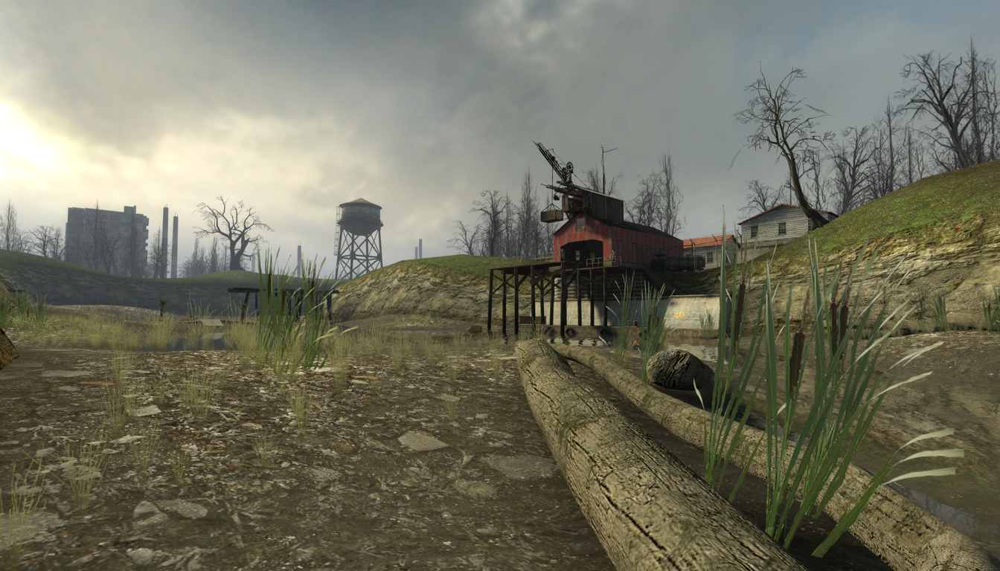
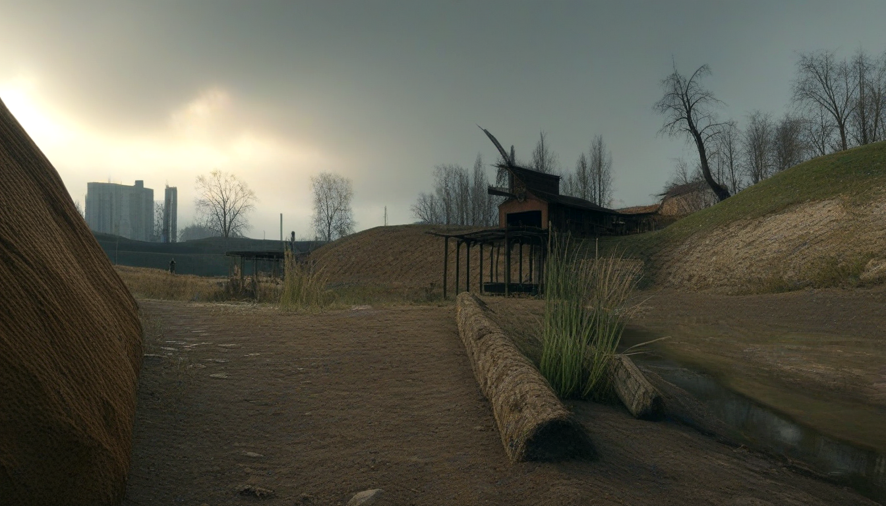

# Half Life 2 → Photoreal Video Distillation
#### Note: Only subset of example images are provided.

Original frame:\
\
Teacher frame:\

<details>
<summary>⚠️ Teacher Demo (contains flashing imagery)</summary>

</details>
<details>
<summary>Basic Temporal Test (may contain flashing imagery)</summary>

</details>

## Details
1. Takes extracted HL2 demo frames (`.tga` or `.png`)
2. Builds structural guides (edges + depth)
3. Generates "teacher" frames (SDXL + ControlNet) into `out/`
4. Exports a clean dataset
5. Trains a deterministic student model (Stage A: single-frame distillation)
6. Runs inference and encodes videos with ffmpeg

## Folder layout

Required inputs:

- `frames_tga/` — extracted HL2 frames (e.g. `aidemo0000.tga` …)

Generated during pipeline:

- `edges/` — edge maps per frame
- `depth/` — depth maps per frame
- `out/` — teacher outputs (SDXL + ControlNet) per frame

Dataset:

- `dataset/seq01/rgb/`
- `dataset/seq01/depth/`
- `dataset/seq01/edges/`
- `dataset/seq01/teacher/`

Student outputs:

- `student_out/` — student predicted frames
- `student_stageA.mp4` — encoded video of student output

```
pip install numpy pillow opencv-python tqdm
pip install torch torchvision --index-url https://download.pytorch.org/whl/cu121
pip install diffusers transformers accelerate safetensors
pip install python-dotenv
```

# Step 1 - Generate Edges (Canny)

python scripts/make_edges.py

# Step 2 - Generate Depth Maps (MiDaS)

python scripts/make_depth.py

# Step 3 - Generate Teacher Frames (SDXL + ControlNet)

python scripts/generate_sdxl_controlnet_video.py

#### Optional - encode teacher video

./make_video.sh

# Step 4 - Export dataset

Creates a clean dataset with normalized naming (000001.png, ....)
`python scripts/export_dataset.py`

Expected output =

```
dataset/seq01/rgb/000001.png
dataset/seq01/depth/000001.png
dataset/seq01/edges/000001.png
dataset/seq01/teacher/000001.png
...
```

# Step 5 - Train stage A student (single frame distillation)

python scripts/train_stageA.py

Checkpoints:
student_stageA/stageA_last.pt

# Step 6 - Inference: Generate student frames

python scripts/infer_stageA.py

# Step 7 - Encode student video (30fps)

./make_student_video.sh

# Step 8 - Stage B (temporal training)

- Warped previous prediction as input
- temporal warp consistency loss

Goal:

- keep stage A consistency
- recover sharp detail without flicker
